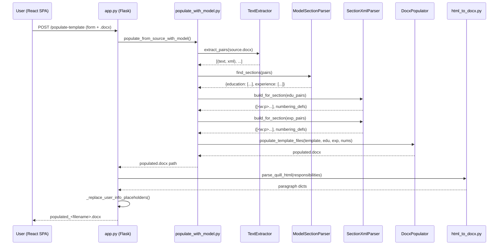

# Data Flow: Template Population Pipeline

This document traces the complete data flow for the "Use Template" workflow — from user input to a populated company CV template.

## Overview

```
┌──────────┐   POST /populate-template    ┌───────────┐
│  React   │ ───────────────────────────▶  │  Flask    │
│  SPA     │                               │  app.py   │
│          │  ◀─────────────────────────── │           │
└──────────┘  populated_<filename>.docx    └───────────┘
```

## Detailed Flow

### 1. User Input (Frontend)

Same form as PII redaction:
- Name, Job Title, Department, Responsibilities (rich text), Resume file (`.docx`)

The user selects **"Use template"** as the output format.

### 2. Request Handling (`app.py`)

```
POST /populate-template
│
├─ Extract form fields: name, jobTitle, department, responsibilities
├─ Save uploaded .docx to temp file
│
└─ Call populate_from_source_with_model(source, template, output, model_path)
```

### 3. Text Extraction (`parser_get_text.py`)

```
TextExtractor.extract_pairs(source_docx)
│
├─ Open .docx via python-docx
├─ Access document.xml body element
│
├─ Traverse all <w:p> paragraphs in document order
│   ├─ Skip paragraphs inside blocked ancestors (<mc:Fallback>)
│   ├─ For each paragraph:
│   │   ├─ Concatenate text from <w:t> elements
│   │   ├─ Normalize unicode:
│   │   │   ├─ Tabs → spaces
│   │   │   ├─ Smart quotes → ASCII quotes
│   │   │   ├─ Em/en dashes → hyphens
│   │   │   └─ Non-breaking spaces → regular spaces
│   │   ├─ Strip leading/trailing whitespace
│   │   └─ Create (cleaned_text, <w:p> element) pair
│   │
│   └─ Deduplicate consecutive identical lines
│       └─ Handles merged table cells that repeat content
│
└─ Return List[(text, xml_element)]
```

### 4. Section Detection (`model_section_parser.py`)

```
ModelSectionParser.find_sections(pairs)
│
├─ Pass 1: Header Detection (Heuristic)
│   │
│   ├─ For each (text, xml) pair:
│   │   ├─ Normalize text (lowercase, strip)
│   │   ├─ Match against education keywords:
│   │   │   "education", "academic", "degree", "university",
│   │   │   "qualification", "certification", ...
│   │   ├─ Match against experience keywords:
│   │   │   "experience", "employment", "work history",
│   │   │   "professional background", "career", ...
│   │   └─ If matched: set current zone = education|experience
│   │
│   └─ Result: Zone boundaries (hard, header-defined)
│
├─ Pass 2: NER Model Voting (ML)
│   │
│   ├─ Batch process all paragraph texts via nlp.pipe()
│   │   └─ spaCy NER extracts entities per paragraph
│   │
│   ├─ For each paragraph's entities:
│   │   ├─ COLLEGE_NAME    → vote education
│   │   ├─ DEGREE          → vote education
│   │   ├─ GRADUATION_YEAR → vote education
│   │   ├─ COMPANIES_WORKED_AT   → vote experience
│   │   └─ YEARS_OF_EXPERIENCE   → vote experience
│   │
│   └─ Result: Per-paragraph votes (soft, model-derived)
│
├─ Resolution
│   │
│   ├─ Header zones always win (high confidence)
│   ├─ Model votes fill gaps for sections missing headers
│   └─ Result: initial per-paragraph section assignment
│
├─ Block Propagation (for header-less sections)
│   │
│   ├─ Identify "entry lines": paragraphs where the model
│   │   voted for a section that has NO header in the document
│   ├─ From each entry line, propagate forward:
│   │   ├─ Override any zone-based assignment on subsequent lines
│   │   ├─ Continue until a header boundary is hit
│   │   ├─ Continue until the model votes for a different section
│   │   └─ Continue if model votes same section (new entry, keep going)
│   └─ Result: full entry blocks captured (title + description + bullets)
│
├─ Contiguity Smoothing
│   │
│   └─ Lone gaps between two same-section paragraphs adopt that section
│
│   └─ Result: {"education": [(text, xml), ...],
│               "experience": [(text, xml), ...]}
│
└─ Fallback: If model load fails → header-only results
```

### 5. XML Fragment Building (`parser_get_section_xml.py`)

```
SectionXmlParser.build_for_section(source_docx, section_pairs)
│
├─ For each (text, xml) pair in section:
│   │
│   ├─ Deep-copy the <w:p> element
│   │   └─ Prevents reference cycles between source and target
│   │
│   └─ _sanitize_paragraph(p_copy)
│       ├─ Remove <w:drawing> elements (images)
│       ├─ Remove <w:pict> elements (legacy images)
│       ├─ Unwrap <w:hyperlink> elements
│       │   └─ Keep display text, remove link wrapper
│       ├─ Strip <w:pStyle> references
│       │   └─ Avoids style ID mismatches in target template
│       ├─ Strip <w:rStyle> references
│       │   └─ Same reason
│       └─ _convert_numbering_to_bullets()
│           └─ Normalize all numbered lists to bullet lists
│               (numbering IDs from source won't exist in target)
│
├─ Extract numbering definitions from source
│   ├─ <w:abstractNum> definitions
│   └─ <w:num> definitions
│
└─ Return (List[<w:p>], (abstract_defs, num_defs))
```

### 6. Template Population (`populate_template.py`)

```
DocxPopulator.populate_template_files(template, edu_xml, exp_xml, numbering)
│
├─ Load template document (FRM-11110-Template.docx)
│
├─ Merge numbering definitions into template
│   ├─ Parse template's numbering.xml
│   ├─ Append <w:abstractNum> definitions from source
│   ├─ Append <w:num> definitions from source
│   └─ Deduplicate by ID to prevent conflicts
│
├─ Replace INSERT_EDUCATION placeholder
│   ├─ Find <w:p> containing "INSERT_EDUCATION" text
│   ├─ Insert all education <w:p> elements after placeholder
│   └─ Remove the placeholder paragraph
│
├─ Replace INSERT_EXPERIENCE placeholder
│   ├─ Find <w:p> containing "INSERT_EXPERIENCE" text
│   ├─ Insert all experience <w:p> elements after placeholder
│   └─ Remove the placeholder paragraph
│
├─ _enforce_ooxml_invariants()
│   ├─ Ensure no empty <w:sdtContent/> elements
│   │   └─ Word rejects documents with empty structured content
│   └─ Ensure every <w:tc> has at least one <w:p>
│       └─ Word requires paragraphs in table cells
│
└─ Save populated template
```

### 7. User Info Replacement (`app.py`)

```
_replace_user_info_placeholders(populated_docx, form_data)
│
├─ Find & replace "INSERT_NAME" → user name
├─ Find & replace "INSERT_TITLE" → user job title
├─ Find & replace "INSERT_DEPARTMENT" → user department
│
└─ Find & replace "INSERT_RESPONSIBILITIES"
    │
    ├─ parse_quill_html(responsibilities_html)
    │   │
    │   ├─ Parse HTML tags: <strong>, <em>, <u>, <ul>, <ol>, <li>
    │   └─ Return List[{
    │         runs: [{text, bold, italic, underline}, ...],
    │         list_type: 'bullet' | 'ordered' | None
    │       }]
    │
    ├─ For each paragraph dict:
    │   ├─ Create <w:p> element
    │   ├─ If list_type: add <w:numPr> with bullet/number reference
    │   └─ For each run:
    │       ├─ Create <w:r> element
    │       ├─ If bold: add <w:b/>
    │       ├─ If italic: add <w:i/>
    │       ├─ If underline: add <w:u w:val="single"/>
    │       └─ Add <w:t> with text content
    │
    └─ Replace placeholder paragraph with generated paragraphs
```

### 8. Response (Frontend)

The frontend receives the binary `.docx` response, creates a download link for `populated_<filename>.docx`, and displays a warning to review the output for any remaining PII.

## Component Interaction Diagram


